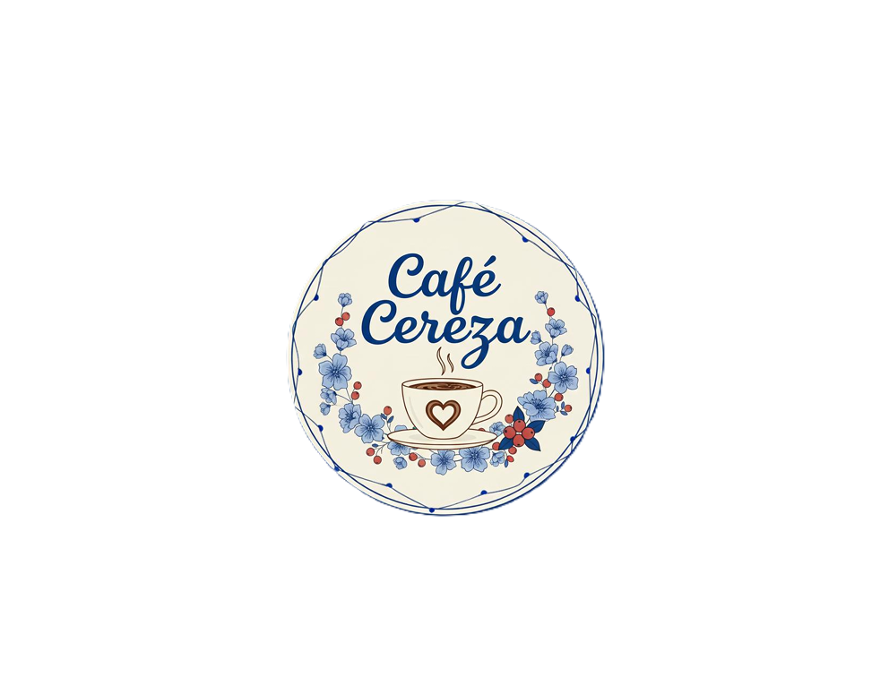

# Proyecto Integrador

## Cafe Cereza

 

Café Cereza es una cafetería consolidada dentro de su comunidad que busca dar un paso más al fortalecer su presencia digital y acercarse a sus clientes de una manera más moderna y directa. Para lograrlo, este proyecto consiste en el desarrollo de una página web que funcione como un espacio accesible e intuitivo, donde los usuarios puedan consultar el menú de alimentos y bebidas, conocer las promociones vigentes y los productos de temporada, revisar los horarios de atención, ubicar fácilmente el establecimiento y encontrar los medios de contacto. Además, el sitio contará con un diseño moderno y responsivo, adaptándose de forma óptima tanto a dispositivos móviles como a computadoras, con el objetivo de mejorar la experiencia del cliente y facilitar el acceso a la información del negocio.

## Tabla de contenido

|Docente|Materia|Implementacion|Descripcion|
|---|---|---|---|
|M.T.I. Marco Antonio Ramírez Hernández|Analitica de Datos para Negocios Digitales|Dashboard|se desarrollará un dashboard interactivo que permitirá a los encargados de Café Cereza visualizar los datos de forma clara y en tiempo real, facilitando el análisis de indicadores relevantes para la toma de decisiones.|
|M.C.C Glendy Marisol Perera Gongora|Gestion de Proyectos|Jira|por definir |
|I.T.I.C Gonzalo Vargas Amador|Ciberseguridad aplicada a los Negocios Digitales|Avisos de Privacidad, Terminos y condiciones| el sitio contará con los Aviso de Privacidad y los Términos y Condiciones de uso, con el fin de brindar mayor transparencia y confianza a los usuarios.|

